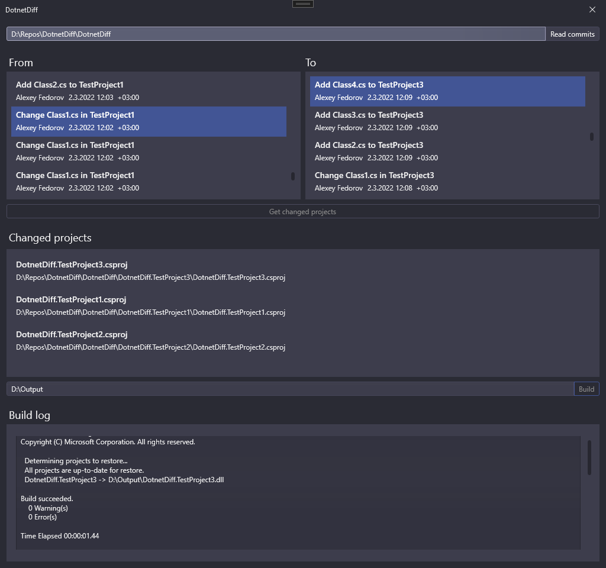

# DotnetDiff

Simple cross-platform library for rebuilding .NET projects (i.e. .csproj) that were changed between several commits. The main purpose of this library is extracting changed assemblies for creating update patches.

## DotnetDiff.UI

Demo application allows to get acquainted with main opportunities of the library.

Rebuild changed assemblies in several steps:

1. Select git repo and press "Read commits"
2. Select commit "From", commit "To" and press "Get changed projects"
3. Specify output folder and press "Build"

